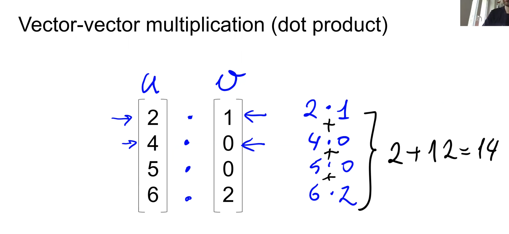
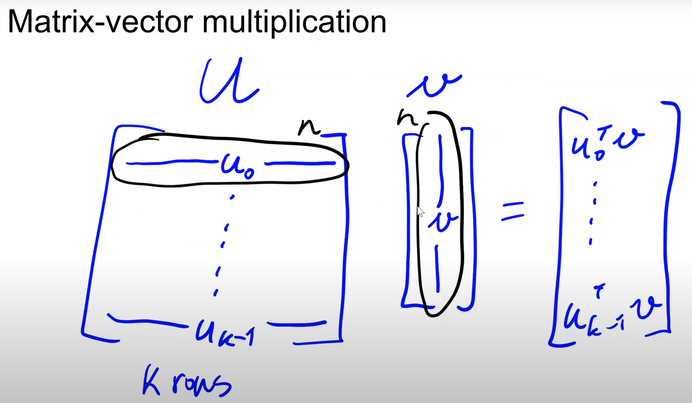
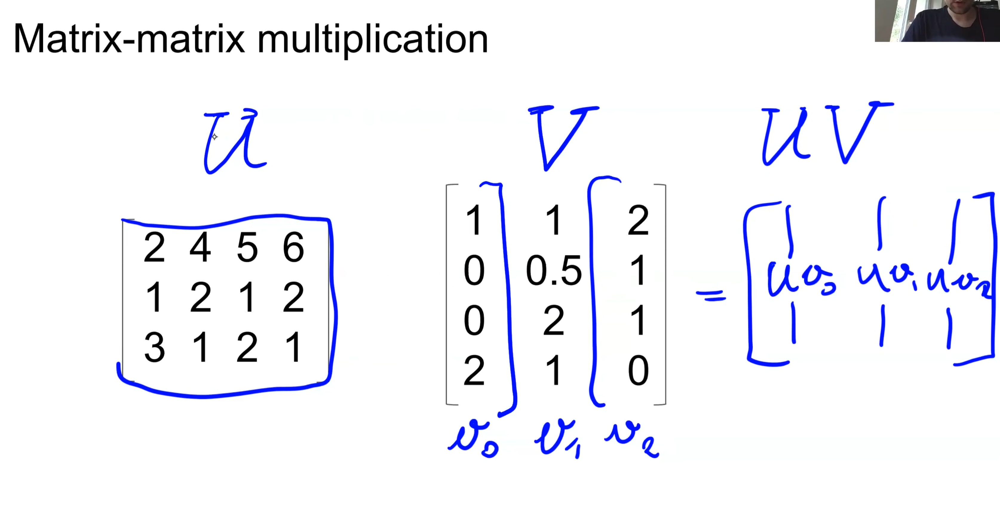

## 1.1 Intro to Machine Learning
The concept of ML is depicted with an example of predicting the price of a car. The ML model learns from data, represented as some **features** such as year, mileage, among others, and the **target** variable, in this case, the car's price, by extracting patterns from the data.

## 1.2 ML vs Rule-Based Systems
The differences between ML and Rule-Based systems is explained with the example of a spam filter.

Traditional Rule-Based systems are based on a set of characteristics (keywords, email length, etc.) that identify an email as spam or not. As spam emails keep changing over time the system needs to be upgraded making the process untractable due to the complexity of code maintenance as the system grows.

ML can be used to solve this problem with the following steps:

1. Get data
Emails from the user's spam folder and inbox gives examples of spam and non-spam.

2. Define and calculate features
Rules/characteristics from rule-based systems can be used as a starting point to define features for the ML model. The value of the target variable for each email can be defined based on where the email was obtained from (spam folder or inbox).

Each email can be encoded (converted) to the values of it's features and target.

3. Train and use the model
A machine learning algorithm can then be applied to the encoded emails to build a model that can predict whether a new email is spam or not spam. The predictions are probabilities, and to make a decision it is necessary to define a threshold to classify emails as spam or not spam.

## 1.3 Supervised Machine Learning
In Supervised Machine Learning (SML) there are always labels associated with certain features.
The model is trained, and then it can make predictions on new features. In this way, the model
is taught by certain features and targets. 

* **Feature matrix (X):** made of observations or objects (rows) and features (columns).
* **Target variable (y):** a vector with the target information we want to predict. For each row of X there's a value in y.

The model can be represented as a function **g** that takes the X matrix as a parameter and tries
to predict values as close as possible to y targets. 
The obtention of the g function is what it is called **training**.

### Types of SML problems 

* **Regression:** the output is a number (car's price)
* **Classification:** the output is a category (spam example). 
	* **Binary:** there are two categories. 
	* **Multiclass problems:** there are more than two categories. 
* **Ranking:** the output is the big scores associated with certain items. It is applied in recommender systems. 

In summary, SML is about teaching the model by showing different examples, and the goal is
to come up with a function that takes the feature matrix as a
parameter and makes predictions as close as possible to the y targets. 

 ## 1.4 Cross-Industry Standard Process for Data Mining
 CRISP-DM, which stands for Cross-Industry Standard Process for Data Mining, is an open standard process model that describes common approaches used by data mining experts. It is the most widely-used analytics model. Was conceived in 1996 and became a European Union project under the ESPRIT funding initiative in 1997. The project was led by five companies: Integral Solutions Ltd (ISL), Teradata, Daimler AG, NCR Corporation and OHRA, an insurance company: 

1. **Business understanding:** An important question is if do we need ML for the project. The goal of the project has to be measurable. 
2. **Data understanding:** Analyze available data sources, and decide if more data is required. 
3. **Data preparation:** Clean data and remove noise applying pipelines, and the data should be converted to a tabular format, so we can put it into ML.
4. **Modeling:** training Different models and choose the best one. Considering the results of this step, it is proper to decide if is required to add new features or fix data issues. 
5. **Evaluation:** Measure how well the model is performing and if it solves the business problem. 
6. **Deployment:** Roll out to production to all the users. The evaluation and deployment often happen together - **online evaluation**. 

It is important to consider how well maintainable the project is.

## 1.5 Model Selection Process
### Which model to choose?

- Logistic regression
- Decision tree
- Neural Network
- Or many others

The validation dataset is not used in training. There are feature matrices and y vectors
for both training and validation datasets. 
The model is fitted with training data, and it is used to predict the y values of the validation
feature matrix. Then, the predicted y values (probabilities)
are compared with the actual y values. 

**Multiple comparisons problem (MCP):** just by chance one model can be lucky and obtain
good predictions because all of them are probabilistic. 

The test set can help to avoid the MCP. Obtaining the best model is done with the training and validation datasets, while the test dataset is used for assuring that the proposed best model is the best. 

1. Split datasets in training, validation, and test. E.g. 60%, 20% and 20% respectively 
2. Train the models
3. Evaluate the models
4. Select the best model 
5. Apply the best model to the test dataset 
6. Compare the performance metrics of validation and test 

## 1.6 Setting up the Environment
##  Setting up the Environment

In this section, we'll prepare the environment

You need:

* Python 3.9 (note that videos use 3.8)
* NumPy, Pandas and Scikit-Learn (latest available versions) 
* Matplotlib and Seaborn
* Jupyter notebooks

## 1.7 Introduction to NumPy
[Notebook](notebooks/07-numpy.ipynb)

## 1.8 Linear Algebra Refresher
* Vector operations
* Multiplication
  * Vector-vector multiplication
  * Matrix-vector multiplication
  * Matrix-matrix multiplication
* Identity matrix
* Inverse

### Vector operations
~~~~python
u = np.array([2, 7, 5, 6])
v = np.array([3, 4, 8, 6])

# addition 
u + v

# subtraction 
u - v

# scalar multiplication 
2 * v
~~~~
### Multiplication

#####  Vector-vector multiplication

~~~~python
def vector_vector_multiplication(u, v):
    assert u.shape[0] == v.shape[0]
    
    n = u.shape[0]
    
    result = 0.0

    for i in range(n):
        result = result + u[i] * v[i]
    
    return result
~~~~

#####  Matrix-vector multiplication

~~~~python
def matrix_vector_multiplication(U, v):
    assert U.shape[1] == v.shape[0]
    
    num_rows = U.shape[0]
    
    result = np.zeros(num_rows)
    
    for i in range(num_rows):
        result[i] = vector_vector_multiplication(U[i], v)
    
    return result
~~~~

#####  Matrix-matrix multiplication

~~~~python
def matrix_matrix_multiplication(U, V):
    assert U.shape[1] == V.shape[0]
    
    num_rows = U.shape[0]
    num_cols = V.shape[1]
    
    result = np.zeros((num_rows, num_cols))
    
    for i in range(num_cols):
        vi = V[:, i]
        Uvi = matrix_vector_multiplication(U, vi)
        result[:, i] = Uvi
    
    return result
~~~~
### Identity matrix
like number 1  you will get the same matrix when dot identity matrix
~~~~python
I = np.eye(3)
~~~~
### Inverse

~~~~python
V = np.array([
    [1, 1, 2],
    [0, 0.5, 1], 
    [0, 2, 1],
])
inv = np.linalg.inv(V)
~~~~

Add notes here (PRs are welcome).

<table>
   <tr>
      <td>⚠️</td>
      <td>
         The notes are written by the community.  
         If you see an error here, please create a PR with a fix.
      </td>
   </tr>
</table>

## Links

* [Notebook from the video](notebooks/08-linear-algebra.ipynb)
* [Get a visual understanding of matrix multiplication](http://matrixmultiplication.xyz/)
* [Overview of matrix multiplication functions in python/numpy](https://github.com/MemoonaTahira/MLZoomcamp2022/blob/main/Notes/Week_1-intro_to_ML_linear_algebra/Notes_for_Chapter_1-Linear_Algebra.ipynb) 

## 1.10 Summary

